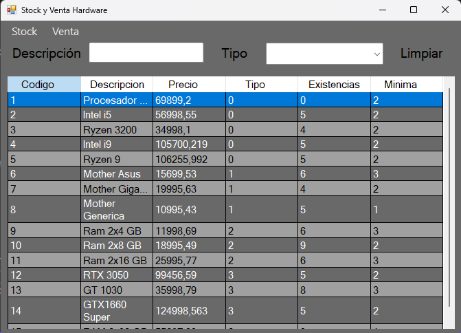

# SistemaVentaHardware
Sistema de gestion de Stock y Venta de Hardware de PC. 
Implementa base de datos SQL con MySQL.

* Implementado: CRUD completo gestión de Stock
* Falta: sistema de venta

# Capturas de Pantalla

## Pantalla Principal
* Muestra un DataGridView con los datos obtenidos de la tabla de MySQL. 
* Contiene textbox para los filtrar por descripcion o tipo.
* Tiene Menús para stock y venta

## Menú Stock

### Stock >> Agregar Item
* Contiene textbox para cargar los campos de la tabla. No permite agregar un código, éste se asigna automáticamente al ingresar en la tabla

### Stock >> Modificar Item
* Contiene textbox para modificar los campos de la tabla. 
* Todo es editable salvo el campo código, el cual es único. 
* El item a modificar se selecciona previamente desde la tabla

### Stock >> Eliminar Item
* Contiene textbox no editables para mostrar el item seleccionado de la tabla para eliminar. 
* Permite editar el campo código para buscar otro item a eliminar
* Borrado físico, tiene un MessageBox para confirmar el borrado

